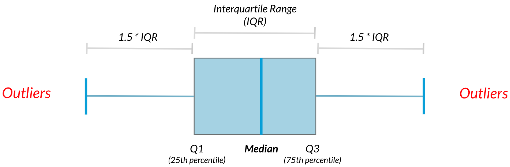

# Summary Statistics

```{r data, warning=FALSE, message=FALSE}
# Libraries
library(dplyr)
library(readr)
library(ggplot2)

# Data
food_consumption <- read_csv("food_consumption.csv")
glimpse(food_consumption)
```

## Exercises

### Mean and Median

In this chapter, you'll be working with the [**2018 Food Carbon Footprint Index**](https://www.nu3.de/blogs/nutrition/food-carbon-footprint-index-2018) from nu3. The `food_consumption` dataset contains information about the kilograms of food consumed per person per year in each country in each food category (`consumption`) as well as information about the carbon footprint of that food category (`co2_emissions`) measured in kilograms of carbon dioxide, or CO2, per person per year in each country.

In this exercise, you'll compute measures of center to compare food consumption in the US and Belgium using your `dplyr` skills.

`dplyr` is loaded for you and `food_consumption` is available.

-   Create two data frames: one that holds the rows of `food_consumption` for `"Belgium"` and the another that holds rows for `"USA"`. Call these `belgium_consumption` and `usa_consumption`.

    -   Calculate the mean and median of kilograms of food consumed per person per year for both countries.

```{r exercise 1}
# Filter for Belgium
belgium_consumption <- food_consumption %>%
  filter(country == "Belgium")

# Filter for USA
usa_consumption <- food_consumption %>%
  filter(country == "USA")

# Calculate mean and median consumption in Belgium
mean(belgium_consumption$consumption)
median(belgium_consumption$consumption)

# Calculate mean and median consumption in USA
mean(usa_consumption$consumption)
median(usa_consumption$consumption)

```

-   Filter `food_consumption` for rows with data about Belgium and the USA.

-   Group the filtered data by `country`.

-   Calculate the mean and median of the kilograms of food consumed per person per year in each country. Call these columns `mean_consumption` and `median_consumption`.

```{r}
food_consumption %>%
  # Filter for Belgium and USA
  filter(country %in% c("Belgium", "USA")) %>%
  # Group by country
  group_by(country) %>%
  # Get mean_consumption and median_consumption
  summarize(mean_consumption = mean(consumption),
      median_consumption = median(consumption))
```

### **Mean vs. median**

In the video, you learned that the mean is the sum of all the data points divided by the total number of data points, and the median is the middle value of the dataset where 50% of the data is less than the median, and 50% of the data is greater than the median. In this exercise, you'll compare these two measures of center.

`dplyr` and `ggplot2` are loaded and `food_consumption` is available.

```{r}
food_consumption %>%
  # Filter for rice food category
  filter(food_category == "rice") %>%
  # Create histogram of co2_emission
  ggplot(aes(x = co2_emission)) +
  geom_histogram()
```

-   The CO2 emiision for rice is right-skewed.

<!-- -->

-   Filter `food_consumption` to get the rows where `food_category` is `"rice"`.

-   Summarize the data to get the mean and median of `co2_emission`, calling them `mean_co2` and `median_co2`.

```{r}
food_consumption %>%
  # Filter for rice food category
  filter(food_category == "rice") %>% 
  # Get mean_co2 and median_co2
  summarize(mean_co2 = mean(co2_emission),
            median_co2 = median(co2_emission))
```

## Measures of spread

### Finding outliers

```{r}
library(openintro)
iqr <- quantile(mammals$body_wt, 0.75) - quantile(mammals$body_wt, 0.25)
iqr
lower_threshold <- quantile(mammals$body_wt, 0.25) - 1.5 * iqr 
upper_threshold <- quantile(mammals$body_wt, 0.75) + 1.5 * iqr
```

```{r}
library(tidyverse)
mammals %>% 
  dplyr::filter(body_wt < lower_threshold | body_wt > upper_threshold) %>% 
  dplyr::select(species, total_sleep, body_wt)
  
```

## Exercises

### Quartiles, quantiles, and quintiles

Quantiles are a great way of summarizing numerical data since they can be used to measure center and spread, as well as to get a sense of where a data point stands in relation to the rest of the data set. For example, you might want to give a discount to the 10% most active users on a website.

In this exercise, you'll calculate quartiles, quintiles, and deciles, which split up a dataset into 4, 5, and 10 pieces, respectively.

The dplyr package is loaded and food_consumption is available.

```{r}
library(readr)
food_consumption <- read_csv("food_consumption.csv")
```

1.  Calculate the quartiles of the co2_emission column of food_consumption.

```{r}
quantile(food_consumption$co2_emission)
```

2.  Calculate the six quantiles that split up the data into 5 pieces (quintiles) of the co2_emission column of food_consumption.

```{r}
quantile(food_consumption$co2_emission, probs = seq(0, 1, by = 0.2))
```

3.  Calculate the eleven quantiles of co2_emission that split up the data into ten pieces (deciles).

```{r}
quantile(food_consumption$co2_emission, probs = seq(0, 1, by = 0.1))
```

### Variance and standard deviation

Variance and standard deviation are two of the most common ways to measure the spread of a variable, and you'll practice calculating these in this exercise. Spread is important since it can help inform expectations. For example, if a salesperson sells a mean of 20 products a day, but has a standard deviation of 10 products, there will probably be days where they sell 40 products, but also days where they only sell one or two. Information like this is important, especially when making predictions.

-   Calculate the variance and standard deviation of co2_emission for each food_category by grouping by and summarizing variance as var_co2 and standard deviation as sd_co2.
-   Create a histogram of co2_emission for each food_category using facet_wrap().

```{r}
# Calculate variance and sd of co2_emission for each food_category
food_consumption %>% 
  group_by(food_category) %>% 
  summarize(var_co2 = var(co2_emission),
     sd_co2 = sd(co2_emission))

# Plot food_consumption with co2_emission on x-axis
ggplot(food_consumption, aes(x = co2_emission)) +
  # Create a histogram
  geom_histogram() +
  # Create a separate sub-graph for each food_category
  facet_wrap(~ food_category)
```

### Finding outliers using IQR

Outliers can have big effects on statistics like mean, as well as statistics that rely on the mean, such as variance and standard deviation. Interquartile range, or IQR, is another way of measuring spread that's less influenced by outliers. IQR is also often used to find outliers. If a value is less than or greater than , it's considered an outlier. In fact, this is how the lengths of the whiskers in a ggplot2 box plot are calculated.



1.  Calculate the total `co2_emission` per country by grouping by country and taking the sum of `co2_emission`. Call the sum `total_emission` and store the resulting data frame as `emissions_by_country`.

```{r}
emissions_by_country <- food_consumption %>% 
  group_by(country) %>% 
  summarize(total_emission = sum(co2_emission))

emissions_by_country
```

2.  Compute the first and third quartiles of `total_emission` and store these as `q1` and `q3`. Calculate the interquartile range of `total_emission` and store it as `iqr`.

```{r}
q1 <- quantile(emissions_by_country$total_emission, 0.25)
q3 <- quantile(emissions_by_country$total_emission, 0.75)
iqr <- q3 - q1
```

3.  Calculate the lower and upper cutoffs for outliers of `total_emission`, and store these as `lower` and `upper`.

```{r}
lower <- q1 - 1.5 * iqr
upper <- q3 + 1.5 * iqr
```

4.  Use `filter()` to get countries with a `total_emission` greater than the `upper` cutoff **or** a `total_emission` less than the `lower` cutoff.

```{r}
# Filter emissions_by_country to find outliers
emissions_by_country %>%
  filter(total_emission < lower | total_emission > upper)
```
