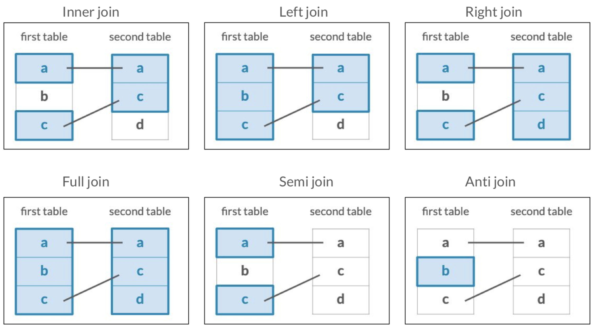

# The joinning verbs

-   Inner join

-   Left join

-   Right join

-   Full join

-   Semi join

-   Anti join



## The questions table

```{r, include=FALSE}
library(readr)
questions <- read_csv("questions.csv", col_types = cols(creation_date = col_date(format = "%Y-%m-%d")))
question_tags <- read_csv("question_tags.csv")
tags <- read_csv("tags.csv")
answers <- read_csv("answers.csv", col_types = cols(creation_date = col_date(format = "%Y-%m-%d")))

```

```{r}
library(tidyverse)
```

```{r}
head(questions)
```

```{r}
head(question_tags)
```

```{r}
head(tags)
```

## Joining data

```{r}
questions_with_tags <- questions %>% 
  inner_join(question_tags, by = c("id" = "question_id")) %>% 
  inner_join(tags, by = c("tag_id" = "id"))
questions_with_tags
```

## Most common tags

```{r}
questions_with_tags %>% 
  count(tag_name, sort = TRUE)
```

## Exercises

### **Left-joining questions and tags**

Three of the Stack Overflow survey datasets are `questions`, `question_tags`, and `tags`:

-   `questions`: an ID and the score, or how many times the question has been upvoted; the data only includes R-based questions

-   `question_tags`: a tag ID for each question and the question's id

-   `tags`: a tag id and the tag's name, which can be used to identify the subject of each question, such as ggplot2 or dplyr

In this exercise, we'll be stitching together these datasets and replacing NAs in important fields.

Note that we'll be using `left_join`s in this exercise to ensure we keep all questions, even those without a corresponding tag. However, since we know the `questions` data is all R data, we'll want to manually tag these as R questions with `replace_na`.

-   Join together `questions` and `question_tags` using the `id` and `question_id` columns, respectively.

```{r}
# Join the questions and question_tags tables
questions_with_tags <- questions %>%
    left_join(question_tags, by = c("id" = "question_id"))
```

-   Use another join to add in the `tags` table.

```{r}
# Join in the tags table
questions_with_tags <- questions %>%
	left_join(question_tags, by = c("id" = "question_id")) %>%
	left_join(tags, by = c("tag_id" = "id"))
```

-   Use `replace_na` to change the `NA`s in the `tag_name` column to `"only-r"`.

```{r}
# Replace the NAs in the tag_name column
questions_with_tags <- questions %>%
  left_join(question_tags, by = c("id" = "question_id")) %>%
  left_join(tags, by = c("tag_id" = "id")) %>%
  replace_na(list(tag_name = "only-r"))
```

### **Comparing scores across tags**

The complete dataset you created in the last exercise is available to you as `questions_with_tags`. Let's do a quick bit of analysis on it! You'll use familiar dplyr verbs like `group_by`, `summarize`, `arrange`, and `n` to find out the average score of the most asked questions.

-   Aggregate by the `tag_name`.

-   Summarize to get the total number of questions, `num_questions`, as well as the mean score for each question, `score`.

-   Arrange `num_questions` in descending order to sort the answers by the most asked questions.

```{r}
questions_with_tags %>%
	# Group by tag_name
	group_by(tag_name) %>%
	# Get mean score and num_questions
	summarize(score = mean(score),
          	  num_questions = n()) %>%
	# Sort num_questions in descending order
	arrange(desc(num_questions))
```

### **What tags never appear on R questions?**

The `tags` table includes all Stack Overflow tags, but some have nothing to do with `R`. How could you filter for just the tags that never appear on an R question? The `tags` and `question_tags` tables have been preloaded for you.

-   Use a join to determine which tags never appear on an R question.

```{r}
# Using a join, filter for tags that are never on an R question
tags %>%
  anti_join(question_tags, 
            by = c("id" = "tag_id"))
```

# Joining questions and answers

## The answers table

```{r}
head(answers)
```

```{r}
questions %>% 
  inner_join(answers, by = c("id" = "question_id"))
```

## Exercises

### **Finding gaps between questions and answers**

Now we'll join together `questions` with `answers` so we can measure the time between questions and answers.

Make sure to explore the tables and columns in the console before starting the exercise. Can you tell how are questions identified in the `questions` table? How can you identify which answer corresponds to which question using the `answers` table?

-   Use an inner join to combine the `questions` and `answers` tables using the suffixes `"_question"` and `"_answer"`, respectively.

-   Subtract `creation_date_question` from `creation_date_answer` within the `as.integer()` function to create the `gap` column.

***If your exercise is timing out, you are likely using the wrong columns for joining, causing the result to be too big! Check the join fields carefully!***

-   In the `questions` table, the questions are identified by the `id` column, and by the `question_id` in the `answers` table.

```{r}
questions %>%
	# Inner join questions and answers with proper suffixes
	inner_join(answers, by = c("id" = "question_id"), suffix = c("_question", "_answer")) %>% 
	# Subtract creation_date_question from creation_date_answer to create gap
	mutate(gap = as.integer(creation_date_answer - creation_date_question))
```

### **Joining question and answer counts**

We can also determine how many questions actually yield answers. If we count the number of answers for each question, we can then join the answers counts with the `questions` table.

-   Count and sort the `question_id` column in the `answers` table to create the `answer_counts` table.

-   Join the `questions` table with the `answer_counts` table.

-   Replace the NA values in the `n` column with 0s.

```{r}
# Count and sort the question id column in the answers table
answer_counts <- answers %>%
	group_by(question_id) %>%
	summarize(n = n())


# Combine the answer_counts and questions tables
questions %>% 
	left_join(answer_counts, by = c("id" = "question_id")) %>%
	# Replace the NAs in the n column
	replace_na(list(n = 0))
```

### Joining questions, answers, and tags

Let's build on the last exercise by adding the tags table to our previous joins. This will allow us to do a better job of identifying which R topics get the most traction on Stack Overflow. The tables you created in the last exercise have been preloaded for you as answer_counts and question_answer_counts.

```{r}
answer_counts <- answers %>% count(question_id, sort = TRUE)

question_answer_counts <- questions %>% left_join(answer_counts, by = c("id" = "question_id")) %>% replace_na(list(n = 0))
```

Combine the question_tags table with question_answer_counts using an inner_join. Now, use another inner_join to add the tags table.

```{r}
question_answer_counts %>%
	# Join the question_tags tables
	inner_join(question_tags, by = c("id" = "question_id")) %>% 
	# Join the tags table
  inner_join(tags, by = c("tag_id" = "id"))
```

### Average answers by question

The table you created in the last exercise has been preloaded for you as `tagged_answers`. You can use this table to determine, on average, how many answers each questions gets.

```{r}
tagged_answers <- question_answer_counts %>%
    inner_join(question_tags, by = c("id" = "question_id")) %>%
    inner_join(tags, by = c("tag_id" = "id"))
```

Some of the important variables from this table include: `n`, the number of answers for each question, and `tag_name`, the name of each tag associated with each question.

Let's use some of our favorite dplyr verbs to find out how many answers each question gets on average.

-   Aggregate the `tagged_answers` table by `tag_name`.

-   Summarize `tagged_answers` to get the count of `questions` and the `average_answers`.

-   Sort the resulting `questions` column in descending order.

```{r}
tagged_answers %>%
	# Aggregate by tag_name
  group_by(tag_name) %>%   
	# Summarize questions and average_answers
    summarize(questions = n(),
              average_answers = mean(n)) %>%
	# Sort the questions in descending order
  arrange(desc(questions))
```

# **The bind_rows verb**

-   Sometimes, we want to stuck a table at the top of another.

```{r}
questions %>% 
  bind_rows(answers)
```

It is important to track the tables adding one more column to identify if it is from the question or the answer table.

## Using bind rows

```{r}
questions_type <- questions %>% 
  mutate(type = "question")
```

```{r}
answers_type <- answers %>% 
  mutate(type = "answer")
```

```{r}
questions_type
answers_type
```

```{r}
posts <- bind_rows(questions_type, answers_type)
posts
```

## Aggregating

```{r}
posts %>% 
  group_by(type) %>% 
  summarize(average_score = mean(score))
```

## Creating date variable

```{r}
library(lubridate)

posts %>% 
  mutate(year = year(creation_date))
```

## Counting date variable

```{r}
question_answer_years <- posts %>% 
  mutate(year = year(creation_date)) %>% 
  count(year, type)
question_answer_years
```

## Plotting date variable

```{r}
question_answer_years %>% 
  ggplot(aes(year, n, color = type)) +
  geom_line()
```

## Exercises

### **Joining questions and answers with tags**

To learn more about the `questions` and `answers` table, you'll want to use the `question_tags` table to understand the tags associated with each question that was asked, and each answer that was provided. You'll be able to combine these tables using two inner joins on both the `questions` table and the `answers` table.

-   Use two inner joins to combine the `question_tags` and `tags` tables with the `questions` table.

-   Now, use two inner joins to combine the `question_tags` and `tags` tables with the `answers` table.

```{r}
# Inner join the question_tags and tags tables with the questions table
questions %>%
  inner_join(question_tags, by = c("id" = "question_id")) %>%
  inner_join(tags, by = c("tag_id" = "id"))

# Inner join the question_tags and tags tables with the answers table
answers %>%
  inner_join(question_tags, by = "question_id") %>%
  inner_join(tags, by = c("tag_id" = "id"))
```

### **Binding and counting posts with tags**

The tables you created in the previous exercise have been preloaded as `questions_with_tags` and `answers_with_tags`. First, you'll want to combine these tables into a single table called `posts_with_tags`. Once the information is consolidated into a single table, you can add more information by creating a date variable using the `lubridate` package, which has been preloaded for you.

```{r}
questions_with_tags <- questions %>%
  inner_join(question_tags, by = c("id" = "question_id")) %>%
  inner_join(tags, by = c("tag_id" = "id"))
```

```{r}
answers_with_tags <- answers %>%
  inner_join(question_tags, by = "question_id") %>%
  inner_join(tags, by = c("tag_id" = "id"))
```

-   Combine the `questions_with_tags` and `answers_with_tags` tables into `posts_with_tags`.

-   Add a `year` column to the `posts_with_tags` table, then aggregate to count posts by `type`, `year`, and `tag_name`.

```{r}
# Combine the two tables into posts_with_tags
posts_with_tags <- bind_rows(questions_with_tags %>% mutate(type = "question"),
                              answers_with_tags %>% mutate(type = "answer"))


# Add a year column, then aggregate by type, year, and tag_name
posts_with_tags %>%
    mutate(year = year(creation_date)) %>%
    count(type, year, tag_name) 
```

### **Visualizing questions and answers in tags**

In the last exercise, you modified the `posts_with_tags` table to add a `year` column, and aggregated by `type`, `year`, and `tag_name`. The modified table has been preloaded for you as `by_type_year_tag`, and has one observation for each type (question/answer), year, and tag. Let's create a plot to examine the information that the table contains about questions and answers for the `dplyr` and `ggplot2` tags. The `ggplot2` package has been preloaded for you.

```{r}
by_type_year_tag <- posts_with_tags %>%
  mutate(year = year(creation_date)) %>%
  count(type, year, tag_name)
```

-   Filter the `by_type_year_tag` table for the dplyr and ggplot2 tags.

-   Create a line plot with that filtered table that plots the frequency (`n`) over time, colored by question/answer and faceted by tag.

```{r}
# Filter for the dplyr and ggplot2 tag names 
by_type_year_tag_filtered <- by_type_year_tag %>%
  filter(tag_name %in% c("dplyr", "ggplot2"))

# Create a line plot faceted by the tag name 
ggplot(by_type_year_tag_filtered, aes(x = year, y = n, color = type)) +
  geom_line() +
  facet_wrap(~ tag_name)
```
