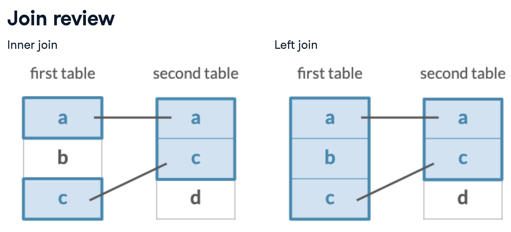

# The inner_join verb

## Base de dados

-   Vamos trabalhar com a base de dados LEGO.

-   Lembre de definir o diretório de trabalho. Sempre defino o diretório de trabalho na pasta em que está o arquivo .R.

```{r, message=FALSE}
# Bibliotecas
library(dplyr)
library(readr)

```

```{r, message=FALSE}
sets <- read_csv("dados/sets.csv")
glimpse(sets)
```

```{r}
head(sets)
```

-   Há uma outra base de dados chamada `themes`.

-   A variável `theme_id` (da base de dados `set`) faz o link com a variável `id` da base de dados `themes.`

```{r}
themes <- read_csv("dados/themes.csv")
head(themes)
```

## Inner join

-   O argumento `by` "diz" ao verbo `inner_join` como as bases devem ser colocadas juntas.

```{r}
joining_df <- sets %>% 
  inner_join(themes, by = c("theme_id" = "id"))
head(joining_df)
```

```{r}
names(joining_df)
```

-   Note que temos duas variável `name`:

    -   `name.x` para a primeira data frame, e

    -   `name.y` para a segunda.

-   Isso ocorre porque não se poder ter duas variáveis com o mesmo nome.

## Customizing your join

-   Para deixar os nomes das variáveis compartilhas mais claros, podemos adicionar um argumento à função `inner_join` :

```{r}
joining_df2 <- sets %>% 
  inner_join(themes, 
             by = c("theme_id" = "id"),
             suffix = c("_set", "_theme"))
head(joining_df2)
```

## Most common themes

```{r}
joining_df2 %>% 
  dplyr::count(name_theme, sort = TRUE)
```

## Exercícios

### **What columns would you join on?**

You'll be joining together the `parts` and `part_categories` tables. You can first inspect them in the console. To join these two tables together using the `inner_join` verb, what columns would you join from each table?

```{r, message=FALSE}
# Carregando os dados
parts <- read_csv("dados/parts.csv")
part_categories <- read_csv("dados/part_categories.csv")
```

suffix = c("\_set", "\_theme")

```{r}
parts %>% 
  inner_join(part_categories, 
             by = c("part_cat_id" = "id"),
             suffix = c("_part", "_category"))
```

## Joining with a one-to-many relationship

-   **The** `inventories` **table:**

```{r}
library(readr)
inventories <- read_csv("dados/inventories.csv")
glimpse(inventories)
```

-   Quando a coluna que queremos juntar tem o mesmo nome, o `by` recebe somente este nome:

```{r}
sets_plus_inventories <- sets %>% 
  inner_join(inventories, by = "set_num")
dim(sets_plus_inventories)
```

-   A tabela resultante do `join`, tem mais linhas, porque cada elemento tem várias versões:

-   Filtrando para a versão 1:

```{r}
sets_plus_inventories %>% 
  dplyr::filter(version == 1)
```

## Exercises

### **Joining parts and inventories**

The LEGO data has many tables that can be joined together. Often times, some of the things you care about may be a few tables away (we'll get to that later in the course). For now, we know that `parts` is a list of all LEGO parts, and a new table, `inventory_parts`, has some additional information about those parts, such as the `color_id` of each part you would find in a specific LEGO kit.

Let's join these two tables together to observe how joining `parts` with `inventory_parts` increases the size of your table because of the one-to-many relationship that exists between these two tables.

-   Connect the `parts` and `inventory_parts` tables by their **part numbers** using an inner join.

```{r}
library(readr)
inventory_parts <- read_csv("dados/inventory_parts.csv")
```

```{r}
# Combine the parts and inventory_parts tables
parts %>%
    inner_join(inventory_parts, by = "part_num")
```

### **Joining in either direction**

An `inner_join` works the same way with either table in either position. The table that is specified first is arbitrary, since you will end up with the same information in the resulting table either way.

Let's prove this by joining the same two tables from the last exercise in the opposite order!

-   Connect the `inventory_parts` table with the `parts` tables.

```{r}
inventory_parts %>% 
  inner_join(parts, by = "part_num")
```

## **Joining three or more tables**

-   Você pode juntar quantas tabelas você quiser usando `inner_join` da mesma forma que você usa vários verbos do `dplyr`.

```{r}
sets_inv_themes <- sets %>% 
  inner_join(inventories, by = "set_num") %>% 
  inner_join(themes, by = c("theme_id" = "id"))
head(sets_inv_themes)
```

-   Veja que temos `name.x` e `name.y`, e podemos modificar isto usando o argumento `suffix`

```{r}
sets_inv_themes2 <- sets %>% 
  inner_join(inventories, by = "set_num") %>% 
  inner_join(themes, by = c("theme_id" = "id"),
             suffix = c("_set", "_theme"))
head(sets_inv_themes2)
```

-   Agora os nomes estão modificados e sabemos de onde vem cada um deles.

## Exercícios

### **Joining three tables**

You can string together multiple joins with `inner_join` and the pipe (`%>%`), both with which you are already very familiar!

We'll now connect `sets`, a table that tells us about each LEGO kit, with `inventories`, a table that tells us the specific version of a given set, and finally to `inventory_parts`, a table which tells us how many of each part is available in each LEGO kit.

So if you were building a Batman LEGO set, `sets` would tell you the name of the set, `inventories` would give you IDs for each of the versions of the set, and `inventory_parts` would tell you how many of each part would be in each version.

-   Combine the `inventories` table with the `sets` table.

-   Next, join the `inventory_parts` table to the table you created in the previous join by the inventory IDs.

```{r}
sets %>%
	# Add inventories using an inner join 
	inner_join(inventories, by = "set_num") %>%
	# Add inventory_parts using an inner join 
	inner_join(inventory_parts, by = c("id" = "inventory_id"))
```

### What's the common color?

Now let's join an additional table, `colors`, which will tell us the color of each part in each set, so that we can answer the question, "what is the most common color of a LEGO piece?"

-   Inner join the `colors` table using the `color_id` column from the previous join and the `id` column from `colors`; use the suffixes `"_set"` and `"_color"`.

```{r}
colors <- colors <- read_csv("dados/colors.csv")
# Count the number of colors and sort
sets %>%
	inner_join(inventories, by = "set_num") %>%
	inner_join(inventory_parts, by = c("id" = "inventory_id")) %>%
  inner_join(colors, by = c("color_id" = "id"), suffix = c("_set", "_color"))
```

-   Count the `name_color` column and sort the results so the most prominent colors appear first.

```{r}
colors <- colors <- read_csv("dados/colors.csv")
# Count the number of colors and sort
sets %>%
	inner_join(inventories, by = "set_num") %>%
	inner_join(inventory_parts, by = c("id" = "inventory_id")) %>%
	inner_join(colors, by = c("color_id" = "id"), suffix = c("_set", "_color")) %>% 
  count(name_color, sort = TRUE)
```

# The left_join verb

## Relembrando o inner_join

```{r}
inventory_parts_joined <- inventories %>% 
  inner_join(inventory_parts, by = c("id" = "inventory_id")) %>% 
  select(-id, -version) %>% 
  arrange(desc(quantity))
inventory_parts_joined 
```

## Filter for LEGO sets

```{r}
batmobile <- inventory_parts_joined %>% 
  filter(set_num == "7784-1") %>% 
  select(-set_num)
```

```{r}
batwing <- inventory_parts_joined %>% 
  filter(set_num == "70916-1") %>% 
  select(-set_num)
```

## Joining with multiple columns

```{r}
batmobile %>% 
  inner_join(batwing, by = c("part_num", "color_id"),
             suffix = c("_batmobile", "_batwing"))
```

-   O inner_join só mantém as informações que aparecem em ambas as tabelas.

-   Se você quiser manter todas as informações em uma tabela, devemos usar outro verbo.

## The left_join

```{r}
names(batmobile)
```

```{r}
names(batwing)
```

```{r}
batmobile %>% 
  left_join(batwing, by = c("part_num", "color_id"),
            suffix = c("_batmobile", "_batwing"))
```

-   Em resumo, vemos o que `inner_join` e `left_join` fazem, na figura abaixo:



## Exercícios

### **Left joining two sets by part and color**

In the video, you learned how to left join two LEGO sets. Now you'll practice your ability to do this looking at two new sets: the Millennium Falcon and Star Destroyer sets. We've created these for you and they have been preloaded for you:

```{r}
millennium_falcon <- inventory_parts_joined %>%
  filter(set_num == "7965-1")
```

```{r}
star_destroyer <- inventory_parts_joined %>%
  filter(set_num == "75190-1")
```

-   Combine the `star_destroyer` and `millennium_falcon` tables with the suffixes `_falcon` and `_star_destroyer`.

```{r}
# Combine the star_destroyer and millennium_falcon tables
millennium_falcon %>%
    left_join(star_destroyer, by = c("part_num", "color_id"),
    suffix = c("_falcon", "_star_destroyer"))
```

-   Usando esta tabela, e as variáveis `part_num` ou `color_id` podemos determinar a frequência que uma parte específica ou peça aperece nos conjuntos de Millenium Falcon e Star Destroyer.

### **Left joining two sets by color**

In the videos and the last exercise, you joined two sets based on their part and color. What if you joined the datasets by color alone? As with the last exercise, the Millennium Falcon and Star Destroyer sets have been created and preloaded for you:

    millennium_falcon <- inventory_parts_joined %>%
      filter(set_num == "7965-1")

    star_destroyer <- inventory_parts_joined %>%
      filter(set_num == "75190-1")

-   Sum the `quantity` column by `color_id` in the Millennium Falcon dataset.

```{r}
# Aggregate Millennium Falcon for the total quantity in each part
millennium_falcon_colors <- millennium_falcon %>%
  group_by(color_id) %>%
  summarize(total_quantity = sum(quantity))

millennium_falcon_colors
```

-   Now, sum the `quantity` column by `color_id` in the Star Destroyer dataset.

```{r}
# Aggregate Star Destroyer for the total quantity in each part
star_destroyer_colors <- star_destroyer %>%
  group_by(color_id) %>%
  summarize(total_quantity = sum(quantity))
star_destroyer_colors
```

-   Left join the two datasets, `millennium_falcon_colors` and `star_destroyer_colors`, using the `color_id` column and the `_falcon` and `_star_destroyer` suffixes.

```{r}
# Left join the Millennium Falcon colors to the Star Destroyer colors
millennium_falcon_colors %>%
  left_join(star_destroyer_colors, by = "color_id", suffix = c("_falcon", "_star_destroyer"))
```

### **Finding an observation that doesn't have a match**

Left joins are really great for testing your assumptions about a data set and ensuring your data has integrity.

For example, the `inventories` table has a `version` column, for when a LEGO kit gets some kind of change or upgrade. It would be fair to assume that all `sets` (which joins well with `inventories`) would have at least a version 1. But let's test this assumption out in the following exercise.

-   Use a `left_join` to join together `sets` and `inventory_version_1` using their common column.

-   `filter` for where the `version` column is `NA` using `is.na`.

```{r}
inventory_version_1 <- inventories %>%
  filter(version == 1)

# Join versions to sets
sets %>%
  left_join(inventory_version_1, by = "set_num") %>%
  # Filter for where version is na
  filter(is.na(version))
```

-   Parece que há casos em que um conjunto não tem uma versão original.

# **The right-join verb**

```{r}
batmobile %>% 
  right_join(batwing, by = c("part_num", "color_id"),
             suffix = c("_batmobile", "_batwing"))
```

-   Left-joins and right-joins are mirror images of each other.

-   Let's calculate the quantity each theme appear:

```{r}
sets %>% 
  count(theme_id, sort = TRUE)
```

-   The most common theme is the id 501, but only knowing the id is not enough. We can add the theme name using `inner_join`

```{r}
sets %>% 
  count(theme_id, sort = TRUE) %>% 
  inner_join(themes, by = c("theme_id" = "id"))
```

-   The most common theme is called Gear.

-   Using `right_join`

```{r}
sets %>% 
  count(theme_id, sort = TRUE) %>% 
  right_join(themes, by = c("theme_id" = "id"))
```

-   The NA in the n column should be zeros. There is a dplyr verb to help on this issue, `replace_na`.

# Replace NAs

```{r}
library(tidyr)
sets %>% 
  count(theme_id, sort = TRUE) %>% 
  right_join(themes, by = c("theme_id" = "id")) %>% 
  replace_na(list(n = 0))
```

# Exercises

## Counting part colors

Sometimes you'll want to do some processing *before* you do a join, *and* prioritize keeping the second (right) table's rows instead. In this case, a right join is for you.

In the example below, we'll count the `part_cat_id` from `parts`, before using a `right_join` to join with `part_categories`. The reason we do this is because we don't only want to know the count of `part_cat_id` in `parts`, but we also want to know if there are any `part_cat_id`s *not* present in `parts`.

Use the `count` verb to count each `part_cat_id` in the `parts` table.

-   Use a `right_join` to join `part_categories`. You'll need to use the `part_cat_id` from the count and the `id` column from `part_categories`.

```{r}
parts %>%
	# Count the part_cat_id
	count(part_cat_id) %>%
	# Right join part_categories
	right_join(part_categories, by = c("part_cat_id" = "id"))
```

-   `filter` for where the column `n` is NA.

```{r}
parts %>%
	# Count the part_cat_id
	count(part_cat_id) %>%
	# Right join part_categories
	right_join(part_categories, by = c("part_cat_id" = "id")) %>% 
  filter(is.na(n))
```

## Cleaning up your count

If you have NA values, you need to add a line to the code above: `replace_na(list(n = 0))`

# Jonining tables to themselves

```{r}
head(themes)
```

Note that some names have the same `parent_id`, for example, Arctic Technic, Competition, Expert Builder and Model have 1 as `parent_id`.

```{r}
themes %>% 
  inner_join(themes, by = c("parent_id" = "id"))
```

## Adding a suffix

```{r}
themes %>% 
  inner_join(themes, by = c("parent_id" = "id"),
             suffix = c("_child", "_parent"))
```

## Lord of the Rings themes: parent

```{r message=FALSE, warning=FALSE}
themes %>% 
  inner_join(themes, by = c("parent_id" = "id"),
             suffix = c("_child", "_parent")) %>% 
  filter(name_child == "The Lord of the Rings")
```

# Exercises

## Joining themes to their children

Tables can be joined to themselves!

In the `themes` table, which is available for you to inspect in the console, you'll notice there is both an `id` column and a `parent_id` column. Keeping that in mind, you can join the `themes` table to itself to determine the parent-child relationships that exist for different themes.

In the videos, you saw themes joined to their own parents. In this exercise, you'll try a similar approach of joining themes to their own *children*, which is similar but reversed. Let's try this out to discover what children the theme `"Harry Potter"` has.

-   Inner join `themes` to their own children, resulting in the suffixes `"_parent"` and `"_child"`, respectively.

-   Filter this table to find the children of the "Harry Potter" theme.

```{r}
themes %>% 
	# Inner join the themes table
	inner_join(themes, by = c("id" = "parent_id"), 
	           suffix = c("_parent", "_child")) %>%
	# Filter for the "Harry Potter" parent name 
	dplyr::filter(name_parent == "Harry Potter")
```

## Joining themes to their grandchildren

We can go a step further than looking at themes and their children. Some themes actually have *grandchildren*: their children's children.

Here, we can inner join `themes` to a filtered version of itself *again* to establish a connection between our last join's children and *their* children.

-   Use another inner join to combine `themes` again with itself.

    -   Be sure to use the suffixes `"_parent"` and `"_grandchild"` so the columns in the resulting table are clear.

    -   Update the `by` argument to specify the correct columns to join on. If you're unsure of what columns to join on, it might help to look at the result of the first join to get a feel for it.

```{r}
# Join themes to itself again to find the grandchild relationships
themes %>% 
  inner_join(themes, by = c("id" = "parent_id"), suffix = c("_parent", "_child")) %>%
  inner_join(themes, by = c("id_child" = "parent_id"), suffix = c("_parent", "_grandchild"))
```

## Left-joining a table to itself

So far, you've been inner joining a table to itself in order to find the children of themes like "Harry Potter" or "The Lord of the Rings".

But some themes might not have any children at all, which means they won't be included in the inner join. As you've learned in this chapter, you can identify those with a left_join and a filter().

-   Left join the themes table to its own children, with the suffixes `_parent` and `_child` respectively.

-   Filter the result of the join to find themes that have no children.

```{r}
themes %>% 
  # Left join the themes table to its own children
  left_join(themes, by = c("id" = "parent_id"), suffix = c("_parent", "_child")) %>%
  # Filter for themes that have no child themes
  filter(is.na(name_child))
```
