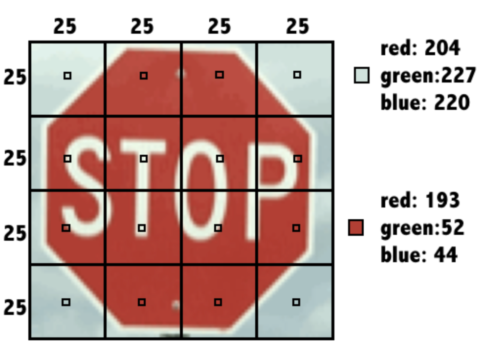

# Libraries

```{r}
library(class)
library(tidyverse)
```

# Data sets

```{r}
loans <- read.csv("https://assets.datacamp.com/production/repositories/718/datasets/7805fceacfb205470c0e8800d4ffc37c6944b30c/loans.csv")

locations <- read.csv("https://assets.datacamp.com/production/repositories/718/datasets/571628c39048df59c40c9dcfba146a2cf7a4a0e3/locations.csv")

knn_traffic_signs <- read.csv("https://assets.datacamp.com/production/repositories/718/datasets/c274ea22cc3d7e12d7bb9fdc9c2bdabe9ab025f4/knn_traffic_signs.csv")

donors <- read.csv("https://assets.datacamp.com/production/repositories/718/datasets/9055dac929e4515286728a2a5dae9f25f0e4eff6/donors.csv")


```

# Exercises

## **Recognizing a road sign with kNN**

After several trips with a human behind the wheel, it is time for the self-driving car to attempt the test course alone.

As it begins to drive away, its camera captures the following image:

Can you apply a kNN classifier to help the car recognize this sign?

The dataset `signs` is loaded in your workspace along with the dataframe `next_sign`, which holds the observation you want to classify.

-   Load the `class` package.

-   Create a vector of sign labels to use with kNN by extracting the column `sign_type` from `signs`.

-   Identify the `next_sign` using the `knn()` function.

    -   Set the `train` argument equal to the `signs` data frame *without* the first column.

    -   Set the `test` argument equal to the data frame `next_sign`.

    -   Use the vector of labels you created as the `cl` argument.

```{r}
signs <- knn_traffic_signs %>% 
  dplyr::select(sign_type:b16)

next_sign <- knn_traffic_signs %>% 
  dplyr::filter(sample == "example")
next_sign <- next_sign %>% 
  dplyr::select(r1:b16)
```

```{r}
# Load the 'class' package
library(class)

# Create a vector of labels
sign_types <- signs$sign_type

# Classify the next sign observed
knn(train = signs[-1], test = next_sign, cl = sign_types)
```

Based on the kNN algorithm, the next sign is a Stop sign.

## **Exploring the traffic sign dataset**

To better understand how the `knn()` function was able to classify the stop sign, it may help to examine the training dataset it used.

Each previously observed street sign was divided into a 4x4 grid, and the red, green, and blue level for each of the 16 center pixels is recorded as illustrated here.

{width="527"}

The result is a dataset that records the `sign_type` as well as 16 x 3 = 48 color properties of each sign.

-   Use the `str()` function to examine the `signs` dataset.

-   Use `table()` to count the number of observations of each sign type by passing it the column containing the labels.

-   Run the provided `aggregate()` command to see whether the average red level might vary by sign type.

```{r}
# Examine the structure of the signs dataset
str(signs)

# Count the number of signs of each type
table(signs$sign_type)

# Check r10's average red level by sign type
aggregate(r10 ~ sign_type, data = signs, mean)
```

As you might have expected, stop signs tend to have a higher average red value. This is how kNN identifies similar signs.

## **Classifying a collection of road signs**

Now that the autonomous vehicle has successfully stopped on its own, your team feels confident allowing the car to continue the test course.

The test course includes 59 additional road signs divided into three types:

  

At the conclusion of the trial, you are asked to measure the car's overall performance at recognizing these signs.

The `class` package and the dataset `signs` are already loaded in your workspace. So is the dataframe `test_signs`, which holds a set of observations you'll test your model on.
